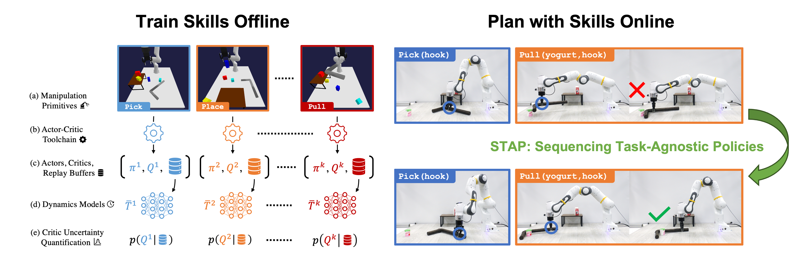

# STAP: Sequencing Task-Agnostic Policies
The official code repository for *"STAP: Sequencing Task-Agnostic Policies,"* presented at ICRA 2023. 
For a brief overview of our work, please refer to our [project page](https://sites.google.com/stanford.edu/stap).
Further details can be found in our paper available on [arXiv](https://arxiv.org/abs/2210.12250).




## Overview

The STAP framework can be broken down into two phases: (1) train skills offline (i.e. policies, Q-functions, dynamics models, uncertainty quantifers); 2) plan with skills online (i.e. motion planning, task and motion planning). 
We provide implementations for both phases:

### :hammer_and_wrench: Train Skills Offline
- **Skill library:** A suite of reinforcement learning (RL) and inverse RL algorithms to learn four skills: `Pick`, `Place`, `Push`, `Pull`. 
- **Dynamics models:** Trainers for learning skill-specific dynamics models from off-policy transition experience.
- **UQ models:** Sketching Curvature for Out-of-Distribution Detection ([SCOD](https://arxiv.org/abs/2102.12567)) implementation and trainers for Q-network epistemic uncertainty quantification (UQ).

### :rocket: Plan with Skills Online
- **Motion planners (STAP):** A set of sampling-based motion planners including randomized sampling, cross-entropy method, planning with uncertainty-aware metrics, and combinations.
- **Task and motion planners (TAMP):** Coupling PDDL-based task planning with STAP-based motion planning.

### :card_index_dividers:	Additionals
- **Baseline methods:** Implementations of Deep Affordance Foresight ([DAF](https://arxiv.org/abs/2011.08424)) and parameterized-action [Dreamer](https://arxiv.org/abs/1912.01603).
- **3D Environments:** PyBullet tabletop manipulation environment with domain randomization.

## Setup

### System Requirements
This repository is primarily tested on Ubuntu 20.04 and macOS Monterey with Python 3.8.10.

### Installation
Python packages are managed through Pipenv.
Follow the installation procedure below to get setup:

```bash
# Install pyenv.
curl https://pyenv.run | bash 
exec $SHELL          # Restart shell for path changes to take effect.
pyenv install 3.8.10 # Install a Python version.
pyenv global 3.8.10  # Set this Python to default.

# Clone repository.
git clone https://github.com/agiachris/STAP.git --recurse-submodules
cd STAP

# Install pipenv.
pip install pipenv
pipenv install --dev
pipenv sync
```

Use `pipenv shell` The load the virtual environment in the current shell.

## Instructions

### Basic Usage
STAP supports [training skills](#training-skills), [dynamics models](#training-dynamics), and composing these components at test-time for [planning](#evaluating-planning).
- **STAP module:** The majority of the project code is located in the package `stap/`. 
- **Scripts:** Code for launching experiments, debugging, plotting, and visualization is under `scripts/`.
- **Configs:** Training and evaluation functionality is determined by `.yaml` configuration files located in `config/`.

#### Launch Scripts
We provide launch scripts for training STAP's required models below.
The launch scripts also support parallelization on a cluster managed by SLURM, and will otherwise default to sequentially processing jobs.

### Model Checkpoints (coming soon!)
As an alternative to training skills and dynamics models, we will soon provide checkpoints that can be downloaded and directly used to [evaluate planners](#evaluating-planning).
<!-- - Skills trained through RL: path/to/drive
- Skills trained through inverse RL: path/to/drive
- Dynamics models: path/to/drive -->

### Training Skills
Skills in STAP are trained independently in custom environments.
We provide two pipelines, [RL](#reinforcement-learning) and [inverse RL](#inverse-reinforcement-learning), for training skills. 
While we use RL in the paper, skills learned via inverse RL yield significantly higher planning performance. 
This is because inverse RL offers more control over the training pipeline, allowing us to tune hyperparameters for data generation and skill training.
We have only tested [SCOD UQ](#optional-uncertainty-quantification) with skills learned via RL.

#### Reinforcement Learning
To simultaneously learn an actor-critic per skill with RL, the relevant command is:
```bash
bash scripts/train/train_agents.sh
```
When the skills have finished training, copy and rename the desired checkpoints.
```bash
python scripts/debug/select_checkpoints.py --clone-name official --clone-dynamics True
```
These copied checkpoints will be used for [planning](#evaluating-planning).

##### (Optional) Uncertainty Quantification
Training SCOD is only required if the skills are intended to be used with an uncertainty-aware planner.
```bash
bash scripts/train/train_scod.sh
```

#### Inverse Reinforcement Learning
To instead use inverse RL to learn a critic, then an actor, we first generate a dataset of demos per skill:
```bash
bash scripts/data/generate_primitive_datasets.sh    # generate skill data
bash scripts/train/train_values.sh                  # train skill critics
bash scripts/train/train_policies.sh                # train skill actors
```

### Training Dynamics
Once the skills have been learned, we can train a dynamics model with:
```bash
bash scripts/train/train_dynamics.sh
```

### Evaluating Planning
With skills and dynamics models, we have all the essential pieces required to solve long-horizon manipulation problems with STAP. 

#### STAP for Motion Planning
To evaluate the motion planners at specified agent checkpoints:
```bash
bash scripts/eval/eval_planners.sh
```
To evaluate variants of STAP, or test STAP on a subset of the 9 evaluation tasks, minor edits can be made to the above launch file.

#### STAP for Task and Motion Planning
To evaluate TAMP involving a PDDL task planner and STAP at specified agent checkpoints:
```bash
bash scripts/eval/eval_tamp.sh
```

### Baseline: Deep Affordance Foresight
Our main baseline is Deep Affordance Foresight (DAF). 
DAF trains a new set of skills for each task, in contrast to STAP which trains a set of skills that are used for all downstream tasks.
DAF is also evaluated on the task it is trained on, whereas STAP must generalize to each new task it is evaluated on.

To train a DAF model on each of the 9 evaluation tasks:
```bash
bash scripts/train/train_baselines.sh
```
When the models have finished training, evaluate them with:
```bash
bash scripts/eval/eval_daf.sh
```

---
## Citation
Sequencing Task-Agnostic Policies is offered under the [MIT License](https://github.com/agiachris/STAP/blob/main/LICENSE) agreement. 
If you find STAP useful, please consider citing our work:
```
@article{agia2022taps,
  title={STAP: Sequencing Task-Agnostic Policies},
  author={Agia, Christopher and Migimatsu, Toki and Wu, Jiajun and Bohg, Jeannette},
  journal={arXiv preprint arXiv:2210.12250},
  year={2022}
}
```
