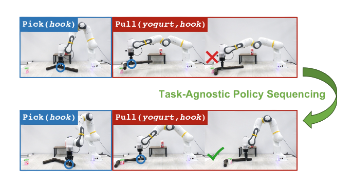

# Text2Motion




## Overview

The code repository for [TAPS: Task-Agnostic Policy Sequencing](https://arxiv.org/abs/2210.12250), in-submission at ICRA 2023. Implementations include:
1. **Manipulation Skills.** Reinforcement learning algorithms ([SAC](https://arxiv.org/abs/1801.01290), [TD3](https://arxiv.org/abs/1802.09477)) to learn four parameterized manipulation policies: `Pick`, `Place`, `Push`, `Pull`. 
2. **Dynamics Models.** Trainers for learning primitive-specific dynamics models from off-policy experience.
3. **Q-Network Uncertainty Quantification.** Sketching Curvature for Out-of-Distribution Detection ([SCOD](https://arxiv.org/abs/2102.12567)) implementation and trainers for quantifying Q-network epistemic uncertainty.
4. **Motion Planners.** A set of sampling-based motion planners including randomized sampling, cross-entropy method, planning with risk-sensitive metrics, and combinations.
5. **Baselines.** Implementations of Deep Affordance Foresight ([DAF](https://arxiv.org/abs/2011.08424)) and parameterized-action [Dreamer](https://arxiv.org/abs/1912.01603).
6. **2D & 3D Environments.** PyBox2D toy environment and full-scale PyBullet tabletop manipulation environment with predicate-specified domain randomization.


## Setup

### System Requirements
This repository has been primarily tested on Ubuntu 20.04 and macOS Monterey with Python 3.8.

### Installation
```bash
# Install Pyenv.
curl https://pyenv.run | bash 
exec $SHELL         # Restart shell for path changes to take effect.
pyenv install 3.8.8 # Install a Python version.
pyenv global 3.8.8  # Set this Python to default.

# Clone repository
git clone git@github.com:agiachris/temporal-policies.git --recurse-submodules
cd temporal_policies

# Install Pipenv.
pip install pipenv
pipenv install --dev
```

To load virtual environment:
```bash
pipenv sync
pipenv shell
```

## Instructions
Task-Agnostic Policy Sequencing was designed modularly to support [training manipulation primitives](#training-manipulation-primitives) and [dynamics models](#learning-dynamics-models), [precomputing SCOD parameters](#pretraining-uncertainty-quantifiers) over primitive Q-networks, and finally, composing all of these components at test-time for [motion planning](#executing-motion-planning).


### Basics
The majority of the project code is located in the temporal policies package `temporal_policies/`, which is pip installable. 
The remaining code for launching experiments, debugging, plotting, and visualization is under `scripts/`.

#### Configs
Training and evaluation functionality is determined by `.yaml` configuration files located in `config/`.

#### Scripts
Scripts for launch training and evaluation can be found in `scripts/`.

Generally, each component of the TAPS framework has a `.sh` and `.py` file; for instance, training policies: `scripts/train/train_policies.sh` and `scripts/train/train_policy.py`). 
The `.sh` file specifies the configs, output paths, and potential checkpoints to be loaded, which are fed to the `.py` file to run. 
This allows multiple instances of the same component to be launched through a single bash script.

#### Factories
The base classes and subclasses of all system components are contained to their own submodule, e.g., `temporal_policies/trainers/`. 
Moreover, every submodule implements a [Factory](https://github.com/agiachris/temporal-policies/blob/main/temporal_policies/utils/configs.py#L143) in `temporal_policies/<submodule_name>/utils.py` which parses a configuration file and optional arguments, such as a checkpoint path, and returns the instantiated class. 

This allows for easily loading subsets of TAPS components for a specific training and evaluation script. 
As examples, [loading an AgentTrainer](https://github.com/agiachris/temporal-policies/blob/main/temporal_policies/trainers/utils.py#L60) requires [loading an Env](https://github.com/agiachris/temporal-policies/blob/main/temporal_policies/envs/utils.py#L8), and [loading a SCODTrainer](https://github.com/agiachris/temporal-policies/blob/main/temporal_policies/trainers/utils.py#L123) requires [loading an Agent](https://github.com/agiachris/temporal-policies/blob/main/temporal_policies/agents/utils.py#L18). 

### Environments
We implement two environments, [PyBox2D](https://github.com/agiachris/temporal-policies/tree/main/temporal_policies/envs/pybox2d) and [PyBullet](https://github.com/agiachris/temporal-policies/tree/main/temporal_policies/envs/pybullet), the former of which is untested for backwards compatibility after extensive changes were made to the code.

The [TableEnv](https://github.com/agiachris/temporal-policies/blob/main/temporal_policies/envs/pybullet/table_env.py#L94) class is used to train all robotic manipulation primitives and evaluate long-horizon plans under domain randomization.
The environment is instantiated according to a configuration file with several key fields.
We will use [pick.yaml](https://github.com/agiachris/temporal-policies/blob/main/configs/pybullet/envs/official/primitives/pick.yaml) as a running example.

#### Primitives
The config first specifies a `pick` under the `primitives:` field.

This field is used to indicate what primitive(s) the environment will use, which determines the action space exposed when training reinforcement learning agents and dynamics models. 
Each primitive comes with a [`PrimitiveAction`](https://github.com/agiachris/temporal-policies/blob/main/temporal_policies/envs/pybullet/table/primitive_actions.py#L6) and [`Primitive`](https://github.com/agiachris/temporal-policies/blob/main/temporal_policies/envs/pybullet/table/primitives.py#L99) implementation. 
- `PrimitiveAction` specifies the skill parameters, their upper and lower bounds, which are used to rescale policy predicted skill parameters from [0,1] to real-world scale;
- `Primitive` implements functions for primitive execution (with collision checking), action sampling where sampled actions are scenario-agnostic and thus prone to failure, and obtaining the [object argument indices](https://github.com/agiachris/temporal-policies/blob/main/temporal_policies/envs/pybullet/table/primitives.py#L135) used to arrange the environment state vector such that target objects are ordered first and the remaining objects are shuffled. 

For reference, see the interplay between [`PickAction`](https://github.com/agiachris/temporal-policies/blob/main/temporal_policies/envs/pybullet/table/primitive_actions.py#L32) and [`Pick`](https://github.com/agiachris/temporal-policies/blob/main/temporal_policies/envs/pybullet/table/primitives.py#L240) in the context of `pick`.

#### Tasks
The config then specifies an `action_skeleton:` and `initial_state:` under the `tasks:` field. 

Tasks are sampled at uniform random, i.e, for `pick`, the environment alternates between training the agent to either pick up a randomly selected block or the hook.

##### Predicates
Initial states of the environment are sampled so as to satisfy the task's [Predicates](https://github.com/agiachris/temporal-policies/blob/main/temporal_policies/envs/pybullet/table/predicates.py#L22).

As shown for `pick`, the initial state indicates that all objects must be placed `On(Predicate)` the table or rack, and that the rack is `Aligned(Predicate)`.
Note that when `.reset()` is called on `TableEnv`, the environment state will be continually sampled until one that [satisfies all predicates](https://github.com/agiachris/temporal-policies/blob/9b6e51814715f56dc2c286eb550faec873e0cef3/temporal_policies/envs/pybullet/table_env.py#L647) is found. 

#### Objects
The configuration file lastly specifies `objects:`. 

This field indicates a list of [Objects](https://github.com/agiachris/temporal-policies/blob/9b6e51814715f56dc2c286eb550faec873e0cef3/temporal_policies/envs/pybullet/table/objects.py) to be spawned during training or evaluation. 
An important object subclass is the [`Variant(WrapperObject)`](https://github.com/agiachris/temporal-policies/blob/9b6e51814715f56dc2c286eb550faec873e0cef3/temporal_policies/envs/pybullet/table/objects.py#L785) which is applied over an [`ObjectGroup`](https://github.com/agiachris/temporal-policies/blob/9b6e51814715f56dc2c286eb550faec873e0cef3/temporal_policies/envs/pybullet/table/objects.py#L632).
This class is used to sample *one-of-n* possible objects instead of representing a concrete one.
The [specification](https://github.com/agiachris/temporal-policies/blob/main/configs/pybullet/envs/official/primitives/pick.yaml#L44) in `pick` indicates that a sampled environment state may contain between 0-4 blocks.


### Training Manipulation Primitives
To train the primitive policies:
```bash
bash temporal_policies/scripts/train/train_policies.sh
```

### Learning Dynamics Models 
To train the dynamics models at multiple policy checkpoints:
```bash
bash temporal_policies/scripts/train/train_dynamics.sh
```

### Pretraining Uncertainty Quantifiers
To train SCOD at multiple policy checkpoints:
```bash
bash temporal_policies/scripts/train/train_scod.sh
```

### Executing Motion Planning
To evaluate the planners at specified policy checkpoints:
```bash
bash temporal_policies/scripts/eval/eval_planners.sh
```


## Citation
Task-Agnostic Policy Sequencing has an MIT License. 
If you find this package helpful, please consider citing our work:
```
```